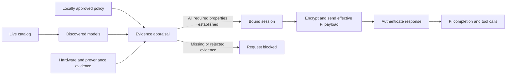

# NEAR AI and Tinfoil providers for Pi: assessment and design

Assessment date: 2026-10-06. Author: Codex. Status: assessment and design completed; Opus 5.5 review reconciled. [Initial SDK-policy implementation and validation](implementation.md) are now available; no production security audit or Approved deployment qualification has been performed. [Independent design review](design-review.md), reviewer: Opus 5.5. [Review resolutions](review-resolution.md).

## Decision

Build the provider integration as Pi extensions, with a shared policy/verification library. Pi already exposes provider authentication, model discovery, request transport, and streaming hooks. Core changes are unnecessary for those features. Enforcing confidentiality across a whole session, including arbitrary model switches and virtual-model fallback, requires an additional dispatch guard; this may merit a Pi contribution. Tinfoil already publishes an extension with API-key `/login`, startup model discovery, encrypted requests, and SDK verification; extend or reuse that baseline. [Pi provider interface](https://github.com/earendil-works/pi/blob/eb326d265ae0b88489a6d10319307780df827cdf/packages/coding-agent/docs/custom-provider.md), [existing Tinfoil extension](https://github.com/tinfoilsh/pi-provider/blob/187fcfc1e04abfc5a44d16bf1523a8a88f38d3ed/tinfoil.ts).

Ship two explicitly different policies:

- **Approved workloads**: only independently approved software, configuration, key custody, and serving paths. This is the default for the user's requested provider-independent trust policy. Missing evidence blocks the request. Initially, a provider/model can have no qualifying deployment and therefore be unavailable in this mode.
- **SDK policy**: use the official SDK's acceptance rules, documenting all additional release, key-service, and deployment authorities. This is an explicit alternative; it must never silently replace Approved workloads after failure.

Do not label either mode “fully TEE verified.” Report the properties actually established: hardware, software approval, provenance, transport binding, downstream serving chain, and response integrity. Neither a valid hardware signature nor a public source repository alone establishes every property.

## Requirements and threat model

The integration must provide `/login`, a current usable model catalog, Pi tool calling and reasoning support where supported, cancellation, usage accounting, and identical enforcement in interactive, print, JSON, and unattended runs.

Approved workloads protects prompts, system messages, tool schemas/results, attachments, completions, and cache contents against malicious inference and cloud operators within the accepted hardware security model. It authenticates the accepted serving software and response channel. It does not establish semantic correctness of model output. Model weights and tokenizers are part of the approved workload because substituted weights can change behavior.

The operator can alter DNS, discovery responses, routing, storage, releases, billing metadata, and deployment instructions, or deny service. These are untrusted inputs. Availability, truthful billing, traffic-analysis resistance, undocumented physical/side-channel protection, and compromise of the user's local machine are outside the confidentiality claim. Vendor advisories and security versions are explicit policy inputs, not waived by the existence of an attestation.

Pi, its runtime, enabled extensions, local inspection hooks, and the user's tools see plaintext. TEE inference does not isolate one local extension from another. Provider extensions guarantee only the requests they dispatch. A separate protected-session feature must gate compaction, background inference, user model switches, and fallback before any protected transcript reaches another provider. Until that guard is demonstrated, the extension must not claim session-wide protection. Cloud title/summarization services and external tools require their own explicit trust decision if they receive thread content.

## Findings and their implications

### Pi integration

`pi.registerProvider()` accepts a complete Provider; `createProvider()` provides native authentication and dynamic publication. `envApiKeyAuth()` supplies a stored API-key login. OpenAI completions accepts a custom `fetch`, so encryption and verification can be enforced beneath Pi's existing message conversion. Use the current `@earendil-works` API, with a tested minimum Pi version. [Registration and discovery](https://github.com/earendil-works/pi/blob/eb326d265ae0b88489a6d10319307780df827cdf/packages/coding-agent/docs/custom-provider.md#supply-and-refresh-models), [authentication helper](https://github.com/earendil-works/pi/blob/eb326d265ae0b88489a6d10319307780df827cdf/packages/ai/src/auth/helpers.ts#L9), [OpenAI transport](https://github.com/earendil-works/pi/blob/eb326d265ae0b88489a6d10319307780df827cdf/packages/ai/src/api/openai-completions.ts).

Pi provides native catalog refresh and stored publications; its remote catalog layer uses a four-hour freshness interval. Use these APIs. `pi update --models` creates a model runtime without loading extensions, so parity for that command requires upstream integration. Print/JSON runs use cached discovery unless the extension explicitly initializes it. These differences affect discovery, never security enforcement. [Native publication](https://github.com/earendil-works/pi/blob/eb326d265ae0b88489a6d10319307780df827cdf/packages/ai/src/models.ts#L1091), [catalog freshness](https://github.com/earendil-works/pi/blob/eb326d265ae0b88489a6d10319307780df827cdf/packages/coding-agent/src/core/remote-catalog-provider.ts#L15), [updater path](https://github.com/earendil-works/pi/blob/eb326d265ae0b88489a6d10319307780df827cdf/packages/coding-agent/src/package-manager-cli.ts#L605).

### Tinfoil

The inspected JavaScript verifier authenticates AMD Genoa SEV-SNP evidence, Sigstore provenance for a configured repository's tagged release, measured-code equality, and attested encryption/certificate bindings. It does not check AMD certificate revocation or implement Intel TDX verification. Its success document is an SDK result, not independent software approval. Tagged-release provenance also supplies no local rollback floor. [Verifier.verifyBundle](https://github.com/tinfoilsh/tinfoil-js/blob/eac102f50ad3c1bfc3fd3cefe8a615671d86fa52/packages/verifier/src/client.ts), [AMD certificate checks](https://github.com/tinfoilsh/tinfoil-js/blob/eac102f50ad3c1bfc3fd3cefe8a615671d86fa52/packages/verifier/src/sev/cert-chain.ts), [repository/tag policy](https://github.com/tinfoilsh/tinfoil-js/blob/eac102f50ad3c1bfc3fd3cefe8a615671d86fa52/packages/verifier/src/sigstore.ts#L86).

`SecureClient.fetch` automatically re-attests and resends on `KeyConfigMismatchError`, without exposing a local approval callback before the resend. Checking its result afterward cannot protect that request. Approved workloads must bypass this method: verify a bundle, enforce exact local approval and rollback rules, then construct the public `ehbp` transport against the accepted key. Own all rotation handling. SDK policy can retain the method only while disclosing its release authority and automatic rotation behavior. [Automatic resend](https://github.com/tinfoilsh/tinfoil-js/blob/eac102f50ad3c1bfc3fd3cefe8a615671d86fa52/packages/tinfoil/src/secure-client.ts#L370).

The router's `updateModelMeasurements()` adopts the latest authenticated backend release for each configured model repository. A router pin therefore approves continuing backend-release authority. A client-side check of a status endpoint is not an atomic constraint on later dispatch. The Go verifier also defaults to the latest `tinfoilsh/hardware-measurements` reference set for TDX; strict use must supply approved hardware measurements explicitly. [Backend update logic](https://github.com/tinfoilsh/confidential-model-router/blob/6494b7daab6c89b94fdd41f1f8e05a79a0115b94/manager/manager.go#L929), [Go hardware-reference selection](https://github.com/tinfoilsh/tinfoil-go/blob/05e817920780362d6c79b0035902d51bd608918b/verifier/client/client.go#L264).

The router's safeguards sidecar receives plaintext for first-party chat; the inspected API-key path skips it. Its configuration, conditional recipients, open egress, and update authority belong in the approved workload. ATC, GitHub proxy, and KDS proxy can be delivery-only only when independent authentication, exact approval, and rollback rules prevent their selection from authorizing a different workload. [Sidecar capture policy](https://github.com/tinfoilsh/confidential-model-router/blob/6494b7daab6c89b94fdd41f1f8e05a79a0115b94/safeguards/capture.go#L44), [router configuration](https://github.com/tinfoilsh/confidential-model-router/blob/6494b7daab6c89b94fdd41f1f8e05a79a0115b94/main.go).

There are two viable strict designs: directly encrypt to an approved worker, bypassing the decrypting router; or approve a router that enforces exact approved backend measurements for each request. The second requires router functionality beyond the inspected latest-release behavior. The first requires reachable workers, appropriate account authentication, and a verifier for their CPU platform. The JS client has custom enclave/repository options; the documented Go verifier and CLI have deployment-artifact digest pins. These establish useful interfaces, not proof that every hosted model is accessible directly. [SecureClient options](https://github.com/tinfoilsh/tinfoil-js/blob/eac102f50ad3c1bfc3fd3cefe8a615671d86fa52/packages/tinfoil/src/secure-client.ts), [workload pins](https://docs.tinfoil.sh/verification/verification-in-tinfoil#pinning-the-expected-workload).

Tinfoil's guest-image repository and public model manifests support source review and rebuilding. The guest includes firmware, kernel, drivers, container machinery, networking policy, and verification code; the inference container and model assets also require approval. GPU checking can be transitive through approved CPU guest code, but that code must attest the actual GPUs and required fabric components, enforce confidential mode, and secure the used CPU–GPU/fabric channels. Define architecture-specific rules, including Blackwell multi-GPU protection; do not demand an irrelevant switch report or accept a missing required one. A separate fresh GPU report with the same nonce does not establish the channel or prove which GPU executed inference. [Guest image](https://github.com/tinfoilsh/cvmimage/tree/46c2430be746e1ad2d783046252d825a77c3f2b1), [guest GPU verifier](https://github.com/tinfoilsh/cvmimage/blob/46c2430be746e1ad2d783046252d825a77c3f2b1/tinfoil/cmd/boot/gpuattest.go), [example model manifest](https://github.com/tinfoilsh/confidential-gemma4-31b/blob/dc843335b9321cba44672c3035d1fe00a610afda/tinfoil-config.yml).

### NEAR AI

The gateway model-report documentation explicitly warns that one model's signing key is shared across instances with differing measured configurations. The returned reports are not a complete fleet inventory. An approved report plus a matching response signature cannot identify the actual instance; model E2EE uses the same signing identity and does not independently repair that ambiguity. [Model-report contract](https://docs.near.ai/cloud/verification/cloud-api/model-attestations), [direct client key selection](https://github.com/nearai/inference-sdk/blob/b9930893a9f560e66898e1616111c5ac2241686c/js/src/core/direct-inference-client.ts#L69).

Direct endpoints expose quote-bound TLS fingerprints. NEAR documents obtaining evidence and sending inference on the same open TLS connection. That is a useful client mechanism, but it establishes instance identity only if the TLS key is confined to the approved serving environment and any downstream route is also constrained. Current direct SDK clients disable TLS binding, citing incomplete fleet coverage. A custom connection-bound transport can reject unverified reconnections without trusting an entire fleet. [Direct TLS flow](https://docs.near.ai/cloud/verification/direct/tls), [SDK limitation](https://github.com/nearai/inference-sdk/blob/b9930893a9f560e66898e1616111c5ac2241686c/js/src/node/direct-attestation-client.ts), [open fleet issue](https://github.com/nearai/cloud-api/issues/1087).

Two public implementation facts prevent treating that mechanism as an already proven strict solution:

1. `cvm-ingress` derives a certificate-encryption key from dstack, restores a certificate archive from S3, and exports the private key. It supports sharing/restoring TLS keys. A public model compose recipe mounts one certificate volume into nginx and the proxy, which attests its on-disk certificate fingerprint. Treat sharing as an unresolved deployment risk until the key-release scope is established. A nonce and the same socket cannot make a shared key instance-exclusive: a key holder can relay the nonce to an approved instance and present its quote. The archive uses unauthenticated AES-256-CBC; archive integrity and anti-rollback need separate enforcement. [Ingress setup](https://github.com/nearai/cvm-ingress/blob/c785c6ed8d4ec0bb0ec4bcb45ef7afe3de48b24e/entrypoint.sh#L19), [certificate export](https://github.com/nearai/cvm-ingress/blob/c785c6ed8d4ec0bb0ec4bcb45ef7afe3de48b24e/lib/certs.sh#L142), [archive encryption](https://github.com/nearai/cvm-ingress/blob/c785c6ed8d4ec0bb0ec4bcb45ef7afe3de48b24e/lib/crypto.sh), [fingerprint tracker](https://github.com/nearai/inference-proxy/blob/993238cf39d53a0c547bb8012d39dfe3d958ae77/src/attestation.rs#L800).
2. `compose-manager` can remotely change running containers and settings. Its attested action log is useful evidence, but a preflight snapshot cannot prevent a subsequent change. Strict operation requires a measured enforcement mechanism limiting all mutations to independently approved workloads for the session, or invalidating its keys before any unapproved change. Simply taking another quote does not make dispatch atomic. [Deployment manager](https://github.com/nearai/compose-manager/blob/aa9de34419c753c432259ecbcc717b6e2a7357c6/README.md).

The public compose recipe also runs unpinned PyPI tooling through `uvx` to download Hugging Face assets at startup, uses a shared model cache, and enables `--trust-remote-code`. A revision string alone is insufficient: approved measured code must verify the bytes of weights, tokenizer, remote code, and download tooling before use. Include privileged containers, dstack socket access, telemetry, the registrar, and all key/plaintext-capable processes in the CVM closure. Name recipe writers and compose-manager token holders, including their environment-override powers. The OHTTP implementation derives its gateway from the signing secret and inherits the shared-key risk. [Runtime download](https://github.com/nearai/cvm-compose-files/blob/cda2032fa8f8638639d858703b6de4d76c2118e8/prod/dsv4-qwen36-gemma4.yaml#L254), [privileged proxy](https://github.com/nearai/cvm-compose-files/blob/cda2032fa8f8638639d858703b6de4d76c2118e8/prod/dsv4-qwen36-gemma4.yaml#L30), [OHTTP construction](https://github.com/nearai/inference-proxy/blob/993238cf39d53a0c547bb8012d39dfe3d958ae77/src/main.rs#L90).

Public `near-kms` contracts manage allowed compose/image/device values through NEAR and MPC infrastructure. If security depends on those services restricting who receives a shared secret, the trust set includes their deployed code, upgrade/approval authorities, consensus/state-authentication process, and MPC custody assumptions. Public source alone does not pin the deployed contract or its future approvals. Direct use of truly enclave-local transport keys could avoid some of this dependency; it must be demonstrated for the selected deployment. [KMS architecture](https://github.com/nearai/near-kms/blob/dd792a9fa228d33c6dbe615646242d20e9d876a4/README.md).

The SDK's defaults are weaker than the requested policy: `OutOfDate` CPU TCB is accepted, GPU evidence can be optional, and deployment provenance is optional. The Intel adapter does not expose/appraise MRTD or RTMR0–2; complete guest-image appraisal must examine these in the authenticated raw quote. A guest-written OS hash in RTMR3 does not substitute for approved measured boot. The NVIDIA adapter checks an overall remote verdict, rather than locally appraising each device's firmware/reference policy, and fetches JWT verification keys using ordinary HTTPS. Strict operation must authenticate that key bootstrap through pinned keys or an approved rotation mechanism, or explicitly list the accepted WebPKI authorities. NVIDIA's remote verdict policy is an additional accepted manufacturer process if used. [CPU policy](https://github.com/nearai/inference-sdk/blob/b9930893a9f560e66898e1616111c5ac2241686c/js/src/core/dstack-attestation.ts), [Intel adapter](https://github.com/nearai/inference-sdk/blob/b9930893a9f560e66898e1616111c5ac2241686c/js/src/utils/intel.ts#L101), [GPU adapter](https://github.com/nearai/inference-sdk/blob/b9930893a9f560e66898e1616111c5ac2241686c/js/src/utils/nvidia.ts), [policy types](https://github.com/nearai/inference-sdk/blob/b9930893a9f560e66898e1616111c5ac2241686c/js/src/types/verification.ts).

SDK-policy reports must mark the following **not established by the inspected SDK alone**: independent software approval; complete NEAR guest-image appraisal; instance-specific serving identity; CPU–GPU channel association; exact downstream worker identity; Tinfoil JS certificate revocation; rollback protection; immutable runtime/model bytes; and exclusive key custody. Show which properties depend on separately approved guest code, KMS policy, or provider release authority. Do not collapse these into one green indicator.

## Closed trust inventory

Each policy manifest contains a finite list of authorities, accepted keys, software inputs, and update processes. “Trust NVIDIA” or “trust GitHub” is insufficiently precise for the machine-readable manifest.

| Trust component | Required declaration |
| --- | --- |
| Local execution | Pi/extension/verifier/helper versions and artifact hashes; dependency closure; runtime/OS assumptions; enabled plaintext-accessing hooks/extensions. Package registry operators cannot independently authorize an update. |
| CPU manufacturer | Exact accepted AMD or Intel trust anchors and processor/attestation profiles; security-version floors; debug/migration policy; collateral validity and revocation rules. |
| GPU manufacturer | Exact NVIDIA roots or verdict-signing keys; approved firmware/reference measurements, confidential-computing mode, topology, and secure-channel policy. |
| Provenance | Exact Sigstore root bundle, Fulcio/Rekor/CT/timestamp keys actually accepted; GitHub OIDC issuer, repository, workflow, source commit, artifact digest, and build identity. Root updates are explicit policy updates. |
| Software approval | User-controlled policy key or named independent reviewers, approval scope, expiry, and update/revocation procedure. A provider tag is not an approval. |
| Server software | Full firmware/OS/container/configuration/model/tokenizer closure; immutable digests, measured commitments, and approved parsing/mutation/egress/key-handling behavior. |
| Reference and runtime inputs | Tinfoil hardware-measurements entries; NVIDIA RIM/OCSP or remote-verdict policy; NEAR downloader dependencies and verified Hugging Face asset bytes. Registry or hosting signatures do not replace independent content approval. |
| Key custody | Exact generation, export, persistence, provisioning, migration, and deletion policy for all TLS/HPKE/signing/cache secrets. Declare every authority that can obtain a secret or admit another recipient. |
| Deployment administration | Exact recipe/configuration writers, compose-manager token holders and environment overrides, router update controls, privileged containers, dstack socket clients, and all plaintext sidecars. Strict admission requires limits enforced by approved code, not operator promises. |
| Conditional infrastructure | Any KMS, NEAR/MPC/contract authority, freshness witness, or HTTPS key-bootstrap CA whose honesty affects the claim. Exclude a dependency only after showing it merely distributes independently authenticated evidence. |

The CPU/GPU manufacturer branches are selected per deployment, not all enabled implicitly. Hardware signatures can be verified using untrusted collateral distributors when roots, signatures, validity, and revocation information are independently checked. DNS, GitHub download endpoints, S3, registries, and attestation proxies can likewise be delivery-only actors when every relevant input is authenticated and rollback is controlled. Their ability to deny service remains.

The actual fingerprint/SBOM inventory is an implementation deliverable for each enabled deployment. Until it is materialized and approved, the profile is incomplete and cannot acquire Approved workloads status. This assessment specifies the closed-set mechanism; it does not claim a completed exhaustive inventory of either production service.

## Extension architecture

Use two thin provider packages and one shared library with four modules:

| Module | Responsibility |
| --- | --- |
| CatalogAdapter | Fetch/validate provider model metadata through Pi's native refresh/publication APIs; map supported chat capabilities and costs; never grant security approval. |
| PolicyStore | Read a locally approved versioned manifest; reject unknown security fields; verify policy signatures where configured; persist highest accepted version and explicit revocations. |
| VerifierAdapter | Use existing audited cryptographic implementations to return authenticated raw claims and an evidence graph. Do not treat a provider-supplied boolean as a verdict. |
| VerifiedTransport | Own the connection, attested encryption keys, policy epoch, request serialization, response authentication, reconnection, and cancellation. Only this module may send inference bodies. |

The policy decision returns either a bound session or a reasoned rejection. A bound session identifies provider/model, policy digest, verifier version, endpoint key, approved workload identities, and the verified forwarding/GPU chain. Its security attributes cannot be changed by a caller's URL, headers, `fetch`, compatibility option, or refreshed catalog.

### Authentication and model discovery

Provide `/login nearai` and `/login tinfoil` through native API-key authentication, with provider-specific environment overrides and `/logout`. Credentials belong in Pi's credential store, never catalog files, policy manifests, or logs. Browser OAuth is a separate enhancement requiring an officially supported third-party flow; a console web login is not assumed to provide that API.

Use `createProvider({ fetchModels })` for straightforward native discovery, or a full `Provider.refreshModels(context)` when implementing four-hour freshness and conditional requests. Restore `context.stored`, respect `allowNetwork`, `force`, and cancellation, and publish through `context.publish`. No separate catalog database or periodic timer is needed. Advance `checkedAt` on actual revalidation; merely returning cached models through `fetchModels` would reset it in the helper and could postpone refresh indefinitely. The full refresh implementation preserves the stored timestamp when skipping a fresh entry. [Helper persistence](https://github.com/earendil-works/pi/blob/eb326d265ae0b88489a6d10319307780df827cdf/packages/ai/src/models.ts#L1091), [native freshness example](https://github.com/earendil-works/pi/blob/eb326d265ae0b88489a6d10319307780df827cdf/packages/coding-agent/src/core/remote-catalog-provider.ts#L78).

Add `/tee models refresh` for forced discovery. Interactive startup, login, the model picker, and RPC use native refresh; print/JSON use stored discovery, with an explicit initialization path for first-run/headless catalog access. Test `--list-models` and document `pi update --models` separately. Bound and validate snapshots; failed refresh preserves the last valid catalog. An offline catalog is allowed; offline security evidence is allowed only within its explicit validity policy.

Separate discovered from usable models. In Approved workloads, publish policy-eligible models to Pi and show unapproved discoveries with reasons in `/tee models`. If a known model's attested release changes, discovery can remain current while requests block until the new deployment is approved. IDs/aliases from a catalog never alter the selected security identity. In NEAR, use canonical IDs and the documented no-aliasing behavior. Model metadata and prices are provider claims, not hardware-attested capability or billing guarantees.

Reuse Pi's OpenAI conversion and stream handling when possible. Map each provider's actual tool/reasoning fields; omit capabilities without verified semantics and tests. Initial scope is chat/text, tool calls, and supported image inputs. Hosted web search, remote execution, uploaded-file URLs, audio/video, and arbitrary provider options are disabled until payload coverage and any extra recipients are explicitly approved.

### Request and response lifecycle

1. Resolve credentials and the canonical model, then acquire a session under an immutable policy epoch. Preflight requests contain no prompt or tool content. Only credential endpoints explicitly designated by the auth policy receive login credentials.
2. Authenticate hardware evidence and its key/nonce bindings. Appraise full measured software/configuration and every required hop; apply provenance and local approval. Reject missing GPU/forwarding/key-custody evidence in Approved workloads.
3. Build the effective request through Pi, including payload hook modifications. Validate the final serialized payload and encrypt all supported sensitive fields through VerifiedTransport. Reject unclassified fields/attachments. Allowlist outer headers: encrypted bodies do not protect headers, and prompt content/session identifiers must not leak through caller overrides. Authentication headers and metadata disclosures require explicit policy. Reject or ignore unauthorized `models.json` URL, headers, compatibility, transport, and alias overrides.
4. Pin the established key/channel. A reconnect, key change, policy revocation, or unsupported redirect requires new appraisal before resending anything. Strict Tinfoil uses the lower-level transport described above, not the SDK's automatic recovery path. No merely SDK-valid release can replace an approved workload.
5. Authenticate responses. Tinfoil's authenticated encrypted channel may stream authenticated chunks; incomplete/corrupt termination must fail the turn. Where NEAR response signatures are required, return a `Response` after headers, then buffer its body internally and verify the exact protocol-defined request/response bytes before releasing completion bytes or executable tool calls to Pi. Bound memory and duration; oversize or incomplete responses fail. No plaintext disk spill is enabled. Verify timeout behavior against the pinned OpenAI dependency instead of making `fetch` wait for the whole turn.
6. Emit Pi's normal terminal success/error only after required response checks. Abort closes the request and discards buffered output. Enforce retry suppression at both provider and session layers; a possibly executed request is not automatically resent without authenticated non-execution evidence or approved idempotency semantics.

The metadata/evidence cache is distinct from the session cache. Cache collateral within its signed validity bounds; recheck revocation/expiry and local security floors at appraisal. Where a service exposes only boot evidence, key possession proves a live key holder, not a newly measured platform. The profile must state its freshness semantics and must not invent a fresh-quote guarantee. Nonces prove freshness, not software approval, key exclusivity, or CPU–GPU association.

Policy removal prevents new requests and terminates affected in-flight sessions at the next local check; already transmitted data cannot be recalled. Per-request audit metadata records the policy/verifier digest, accepted identities, key bindings, and verification result. Store signed evidence separately with local access control and bounded retention. Evidence may expose host/chip identifiers and must not be automatically uploaded. Do not store prompts, tokens, response bodies, or public prompt hashes in ordinary audit logs.

### Protected sessions and retry enforcement

Throwing from Pi's `before_provider_request` hook does not veto dispatch: `emitBeforeProviderRequest()` catches the exception and continues. Model-selection notifications and context redaction alone are insufficient proof of a guard after virtual-model routing. The provider packages therefore claim request-level enforcement only. A protected-session implementation must gate the resolved physical provider/model after every routing decision and before serialization, including retries, compaction, branch summaries, and background requests. Reject unauthorized model switches or explicit export of the transcript before sending. Reject virtual models until their entire routing path is covered. [Caught hook errors](https://github.com/earendil-works/pi/blob/eb326d265ae0b88489a6d10319307780df827cdf/packages/coding-agent/src/core/extensions/runner.ts#L1361), [virtual routing](https://github.com/earendil-works/pi/blob/eb326d265ae0b88489a6d10319307780df827cdf/packages/coding-agent/src/core/virtual-models.ts).

Prefer a generic Pi core hook with a propagating, fail-closed rejection and the resolved physical identity. A restricted local launcher may substitute only if tests demonstrate equivalent coverage and prevent bypass. Selection reversion and context stripping can improve UX but are not the enforcement boundary. All enabled local extensions remain trusted.

Force provider `maxRetries: 0`, and use a custom stream wrapper to convert security rejection, integrity failure, and ambiguous execution into a fixed terminal error code/message. Do not forward untrusted diagnostic text into Pi's retry classifier: it matches phrases such as `connection error`, `timeout`, and `terminated`. Preserve detailed diagnostics separately without content or secrets. For the inspected Pi revision, a safe terminal message plus zero provider retries is a compatibility mechanism; an explicit typed non-retryable error is the preferred upstream contract. Test turn and summarization retries as well as the transport layer. Every retry that is allowed acquires the same policy epoch and passes all dispatch/approval checks. [Provider retry policy](https://github.com/earendil-works/pi/blob/eb326d265ae0b88489a6d10319307780df827cdf/packages/ai/src/utils/provider-retry.ts#L23), [session error classifier](https://github.com/earendil-works/pi/blob/eb326d265ae0b88489a6d10319307780df827cdf/packages/ai/src/utils/retry.ts#L252), [session retry](https://github.com/earendil-works/pi/blob/eb326d265ae0b88489a6d10319307780df827cdf/packages/coding-agent/src/core/agent-session.ts#L3759).

### Provider-specific implementation choices

**Tinfoil SDK policy:** adapt the existing extension. Keep native `/login`, use native catalog refresh, and add the explicit property report. Rotation reporting is post-hoc under the inspected SDK. Disclose acceptance of any authenticated repository tag, no local rollback floor, router release authority, and conditional plaintext recipients. An SDK success is never displayed as independent approval.

**Tinfoil Approved workloads:** the first target is one reachable direct worker with independently approved deployment measurements and key custody. Prefer a supported SEV path if one exists; the public guest uses per-boot keys and hash-addressed model packaging, but hosted reachability/platform must be demonstrated. Add missing revocation and security-floor appraisal. Use pinned Go verifier primitives for TDX, with an explicit approved hardware-reference set. A structured evidence-only subprocess helper belongs in the local trust inventory. If workers are unavailable, specify a router change: enforce an authenticated per-request allowed-backend manifest before forwarding, include all decrypting sidecars, and disallow unapproved fallback. Do not repeatedly poll router status as strict routing. [Per-boot keys](https://github.com/tinfoilsh/cvmimage/blob/46c2430be746e1ad2d783046252d825a77c3f2b1/tinfoil/internal/attestedkeys/store.go), [model manifest](https://github.com/tinfoilsh/confidential-gemma4-31b/blob/dc843335b9321cba44672c3035d1fe00a610afda/tinfoil-config.yml).

**NEAR SDK policy:** use the official SDK with explicit CPU/GPU/provenance requirements and the property report. Document shared-key, mutable-deployment, runtime-download, and KMS authority. Initially qualify npm Pi on Node 24, matching the SDK's engine declaration. Pi also ships Bun-compiled binaries, so a Node version check is insufficient: detect the actual runtime and probe the required TLS/socket APIs. Bun and Node 22 paths remain unavailable until qualified or supported through a pinned helper. A helper that terminates the secure transport receives plaintext and must be declared accordingly; an evidence-only helper does not. [SDK runtime](https://github.com/nearai/inference-sdk/blob/b9930893a9f560e66898e1616111c5ac2241686c/js/package.json), [Pi binary build](https://github.com/earendil-works/pi/blob/eb326d265ae0b88489a6d10319307780df827cdf/packages/coding-agent/package.json).

**NEAR Approved workloads:** implement the direct fresh-quote/same-TLS-connection transport as a candidate only. Admit a profile after validating instance-exclusive key custody or an independently enforced closed recipient set, plus immutable/approved mutation behavior for the complete serving stack. If the current deployed KMS or compose-manager leaves provider approval authority, the profile stays unavailable. A concrete server-side solution is an enclave-local ephemeral transport key, quote-bound to the complete approved state, that is retired before any unapproved change and used to encrypt traffic to approved backend/GPU endpoints.

An alternative server contract can bind the quote to the actual TLS session using a TLS exporter. The approved in-CVM TLS terminator must compute the exporter from its own connection, and bind a domain-separated hash of the protocol, nonce, exporter, and serving-policy commitment into quote report data. The client compares against its local socket's exporter, using TLS 1.3, then sends inference on that socket. A server that merely quotes a caller-supplied exporter remains vulnerable to relay. If nginx terminates TLS, the audited bridge to the quote producer is part of the closure. Use one attestation authentication instance per connection and close afterward. This is a proposed protocol, not an existing NEAR capability. [TLS exporter definition and uniqueness](https://www.rfc-editor.org/rfc/rfc9266.html#section-2), [application binding constraints](https://www.rfc-editor.org/rfc/rfc9266.html#section-4.1).

That binding can defeat evidence relay even with a shared certificate, but cannot constrain later deployment mutation, downstream dispatch, leaked application keys, or unverified model bytes. Those require approved server enforcement too. The inspected public NEAR recipe cannot become an Approved profile through client checks alone; alternative deployed mechanisms would need equivalent evidence. The NEAR proof of concept should establish the missing contract and negative tests before promising a production profile.

## Public releases and later detection

Both services publish substantial server, verifier, and build sources. This permits source review, independent rebuilding, and monitoring. It does not guarantee later discovery of malicious behavior: nobody may review a subtle change, a build may not match source, external configuration can change, or a hidden instance can reuse a shared identity.

Implement an optional independent release monitor outside the inference critical path. For approved repository/workflow identities, archive authenticated provenance, source commits, manifests, artifacts, and log receipts; independently rebuild; compare results; review changes; and issue local approval/revocation decisions. Public logged provenance creates durable evidence of a release, not evidence that a particular request used it. Monitoring must not be presented as closing NEAR's shared-instance ambiguity or a router's unconstrained dispatch.

Automatically accepting new authenticated releases retains provider release authority until review, even with a waiting period. A delay can provide review time; it is not itself approval. For the user's intended closed trust set, require affirmative independent approval before adoption. Transparency monitors and rebuild tooling are themselves named processes, with pinned inputs and a declared operator/update authority.

## Validation and release gates

Use adversarial tests at the network boundary, asserting that sensitive request bytes never leave before approval:

| Case | Required result |
| --- | --- |
| Valid signatures but unapproved release/configuration | Block before inference payload. |
| Older authentic tag or stale hardware-reference release | Reject local rollback/revocation violations; neither proxy selection nor `latest` can expand approval. |
| Same signing or TLS key advertised by another measured configuration | No inference from signature/key equality alone; apply custody and serving-chain rules. |
| Nonce relayed through another holder of a shared TLS key | Certificate matching alone fails; a session-exporter design must reject the mismatched connection. |
| Router updates backend after a status check | Test demonstrates polling is insufficient; strict mode requires enforcement or direct encryption. |
| Correct nonce but unrelated GPU evidence | Reject absent secure-channel/actual-device assurance. |
| Debug mode, prohibited TCB status, revoked/expired collateral | Block, including when a cache entry exists. |
| Tampered provenance, wrong workflow/commit/digest, unknown trust root | Block; no root acquisition from provider metadata. |
| TLS reconnect, shared certificate, redirect, key rotation | Appraise the new session/custody under the same policy or block. |
| Tinfoil rotation to an SDK-valid but unapproved release | No second inference send, including inside SDK recovery. |
| Runtime deployment mutation or extra sidecar/container | Reject or terminate according to the attested enforcement contract. |
| Staged versus activated configuration, environment override, or changed cached model bytes | Appraise the active workload; verify runtime asset bytes before inference. |
| TDX MRTD/RTMR0–2 mismatch or incorrect GPU count/fabric policy | Block even when configuration/RTMR3 and an overall GPU verdict match. |
| Malformed catalog, new alias, unsupported option/media URL | No policy expansion, alternate transport, or unauthorized recipient. |
| Caller headers or `models.json` URL/compatibility override | No plaintext header leakage or alternate unapproved transport. |
| Modified request hook, truncated stream, invalid/missing response signature | Verify effective bytes; no executable tool call or terminal success. |
| Provider retry and turn/summarization retry after a security or integrity failure | At most one attempted inference send, zero if approval fails first; terminal failure without automatic replay. |
| User model switch, Ctrl-P/`--models` cycling, virtual fallback, compaction | Protected-session guard blocks unauthorized physical dispatch; provider-only installation makes no session-wide claim. |
| Node/Bun capability failure, cancellation, timeout, oversized response | Fail closed in interactive and headless modes; no unverified output or transport fallback. |
| Catalog outage and policy rollback/revocation | Catalog can stay cached; security approval cannot silently revert. |

Production Approved workloads requires a live end-to-end demonstration for each enabled deployment profile, matching independent rebuild/source approval, complete hardware/configuration appraisal, key-custody review, GPU/channel review, and mutation/forwarding enforcement. Add an independent security review of the verifier and transport. Passing mocked tests or SDK verification alone cannot enable the production label.

## Scope, effort, and contribution plan

Planning estimates for one engineer familiar with TypeScript and attestation, not measured implementation times:

| Work | Estimated effort and dependency |
| --- | --- |
| Tinfoil baseline integration | Already exists; review and adapt rather than rebuild. |
| NEAR native API-key login, catalog, ordinary Pi compatibility | About 3–5 engineering days, excluding account/live-service issues. |
| Shared policy reporting, guards, refresh, and integration tests for both SDK policies | About 1–2 additional weeks. |
| Approved-workload transport/verifier proof of concept | About 2–4 additional weeks after one concrete reachable deployment is identified. |
| Packaged TDX verifier helper, if needed | Roughly one additional week for pinned builds and macOS/Linux arm64/x64 packaging, conditional on verifier suitability. |
| Protected-session enforcement | Scope the resolved-dispatch hook and coverage in Pi first; implementation and upstream acceptance are separate from provider integration. |
| Full production trust closure | Cannot responsibly give a fixed date before the key-custody, mutation, worker-access, and GPU-path gates pass; may require provider server changes and independent audit. |

The few-day estimate covers API integration. Removing provider authority requires the separate transport, workload-approval, and production verification work above.

Implementation order: (1) pin the Tinfoil baseline and create NEAR's provider; (2) add auth and native catalog support; (3) implement shared policy/evidence/session contracts, retry suppression, and negative tests; (4) prove one direct Tinfoil worker and establish NEAR's missing server contract; (5) implement and test protected-session dispatch enforcement; (6) independently approve the full dependency and key inventory; (7) enable only profiles that pass all release gates.

Keep provider packages independently installable. The concrete Pi contribution candidate is a fail-closed hook after physical-model routing, plus a typed non-retryable failure contract. SDK contributions can expose pre-send workload-pin/rotation approval. Server contributions can enforce approved backends, immutable runtime closure, and session-bound attestation/key custody. No external issue, PR, or vendor message is authorized by this assessment; prepare concrete changes for user review before submitting.

## Assessment boundary

The assessment and architecture are complete. Unproven production properties are release gates: profiles remain unavailable until evidence satisfies them. Research included official documentation and the linked source snapshots. No private-key inventory, live authenticated inference, independent rebuild, exploit, benchmark, or security certification was performed.

Written by Codex.
